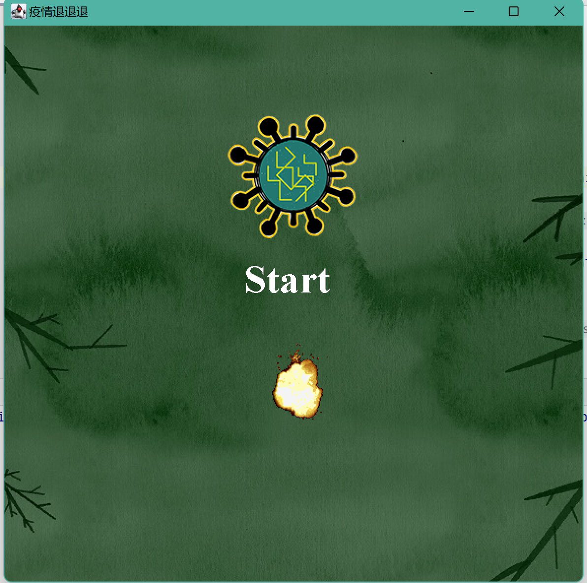

### **Project Structure Explanation**

#### **`imgs` Folder** (Contains the images needed for the game):

- **`explode`** - Explosion animation
- **`boss`** - Virus boss
- **`virus`** - Regular virus
- **`cell`** - Immune cell
- **`bullet`** - Bullets fired by the virus
- **`shell`** - Bullets fired by the immune cell
- **`bk_imgs123`** - Three different background images

---

#### **`src` Folder:**

1. **`com.anti_virus.utils` Package (Utility Classes)**

   - Contains the `GameUtils` utility class.
   - The `GameUtils` class includes methods for displaying backgrounds, viruses, cells, and other game objects.
   - **Note:** When downloading the project, modify lines **8-13** in the code to set the correct image path; otherwise, images may not load properly.

2. **`obj` Package (Game Object Classes)**

   - **`GameObj` Class**
     - This is the parent class for all game objects (virus, boss, cell, etc.).
     - It includes both parameterized and non-parameterized constructors to facilitate the creation of specific game entities.
   - **`BgObj` Class**
     - Overrides attributes and methods related to the background.
     - Current functionalities: background movement and background looping.
   - **`BossObj` Class**
     - (To be completed...)
   - **`CellObj` Class**
     - Overrides attributes and methods related to immune cells.
     - Current functionalities: immune cells follow the mouse movement.

3. **`GameWin.java` (Main Program)**
   - Includes the game’s startup page design and event listeners for launching the game.
   - Implements double buffering for smoother rendering.

